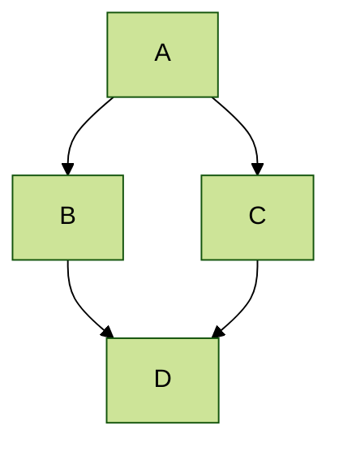



[← Back to Guide]({{ base_path }}/guide/)

## Mermaid diagrams

Academic Pages includes support for [Mermaid diagrams](https://mermaid.js.org/) (version 11.* via [jsDelivr](https://www.jsdelivr.com/)) and in addition to their [tutorials](https://mermaid.js.org/ecosystem/tutorials.html) and [GitHub documentation](https://github.com/mermaid-js/mermaid) the basic syntax is as follows:

```markdown
    ```mermaid
    graph LR
    A-->B
    ```
```

Which produces the following plot with the [default theme](https://mermaid.js.org/config/theming.html) applied:


While a more advanced plot with the `forest` theme applied looks like the following:


